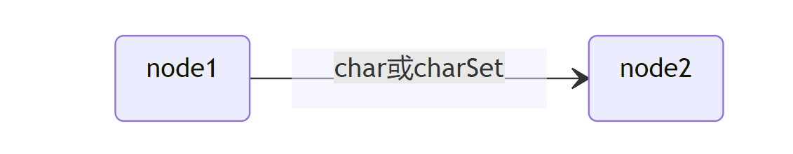
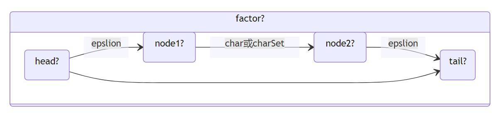
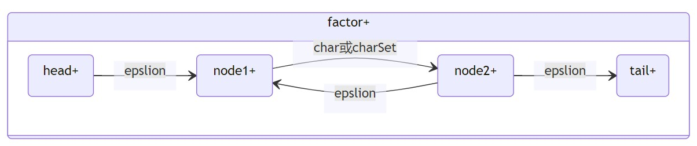
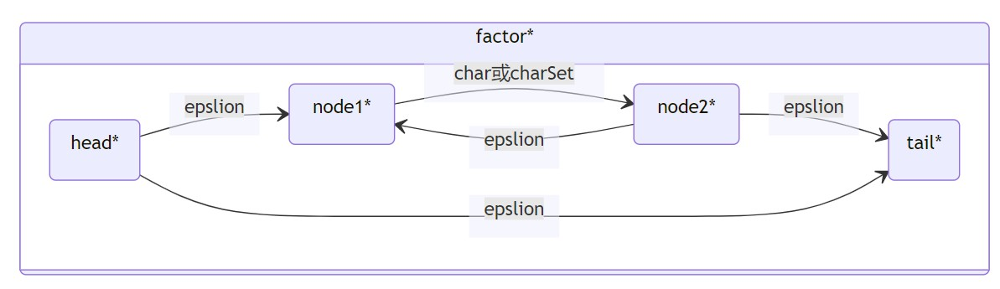
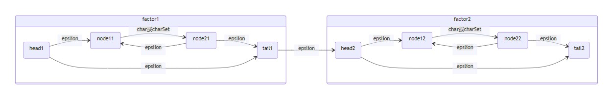
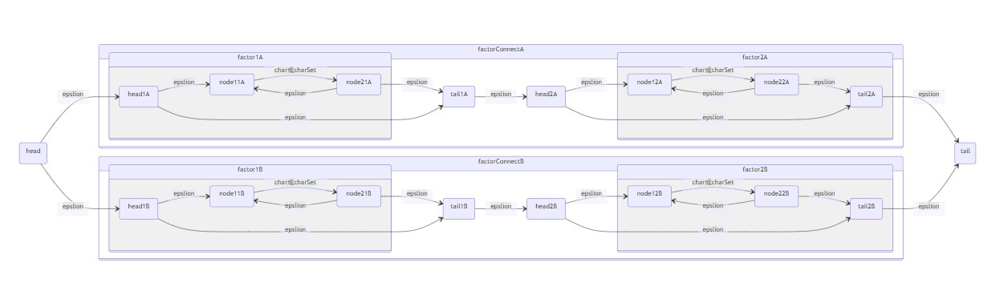
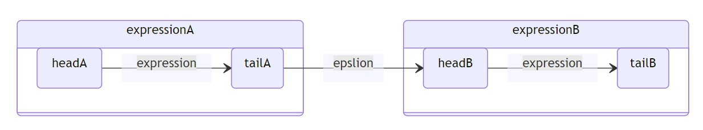

# Regex By C++17

------
本项目参考<https://github.com/dejavudwh/Regex>
>相对于原项目,本项目增添了{n,m}型闭包和部分转义字符  
>添加了 **contains(std::string_view& input)** 函数用于查找所有符合正则表达式的字符串  
>添加了(expression) [*|?|+]型正则  

## Regex的BNF范式有

>regexExpression ::= ("(" groupExpression ")")*  
>groupExpression ::= ("(" expression ")")[*+?]  
>expression ::= factorConnect ("|" factorConnect)*  
>factorConnect ::= factor | factor·factor*  
>factor ::= (("(")("^")term("$")(")") | ("(")("^")term("*" | "+" | "?" | "{n,m}")($)(")"))*  
>term ::= char | "[" char "-" char "]" | .  

## term阶段

## factor阶段

## factorConnect阶段

## expression阶段

## groupExpression阶段

由此可见,在NFA构建阶段中的环主要是在**factor阶段**出现
